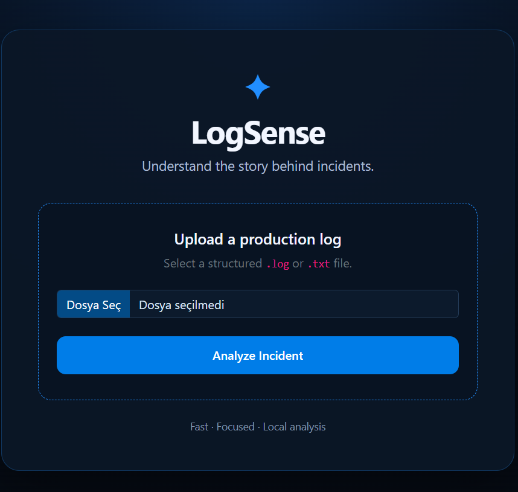
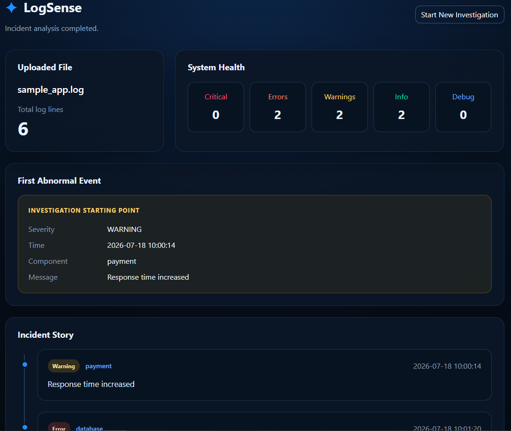

# ⭐ LogSense

### Understand the Story Behind Incidents

LogSense is a web application designed to help Operations, SRE, and DevOps engineers investigate production incidents faster by transforming raw log files into a clear **Incident Story**.

Instead of searching through thousands of log lines, LogSense identifies important events, highlights where an incident began, and presents the investigation in a structured and easy-to-understand format.

---

## 🚀 Why LogSense?

During production incidents, engineers often spend valuable time answering questions like:

- Where did the incident start?
- Which component failed first?
- What happened next?
- Did the system recover?

Traditional log analysis tools display large amounts of raw data.

LogSense focuses on telling the **story of the incident**, allowing engineers to understand problems faster and begin their investigation with confidence.

---

## ✨ Current Features

- 📂 Upload `.log` and `.txt` files
- ✅ File validation
- ⚡ Stream large log files efficiently
- 📊 Severity summary
    - Critical
    - Error
    - Warning
    - Info
    - Debug
- 🚨 First abnormal event detection
- 📖 Incident Story generation
- 🎨 Modern dark user interface

---

## 🛠️ Technology Stack

- Python
- FastAPI
- Jinja2
- HTML
- Bootstrap 5

---
## 📸 Screenshots

### Home Page

---

### Incident Analysis

## 🧭 Roadmap

### Version 0.3
- Better Incident Story visualization
- Timeline improvements
- Improved component detection

### Version 0.4
- Scope detection
- Impact analysis
- Event correlation

### Version 1.0
- AI-powered investigation assistant
- Root cause suggestions
- Smart incident summaries

---

## 💡 Vision

LogSense is not intended to replace engineers.

Its goal is to reduce investigation time by helping engineers quickly understand **what happened**, **where it started**, and **how the incident evolved**.

---

## 👩‍💻 Author

**Burcu Aslan**

Team Lead | Scrum Master | Automation & IT Systems Engineer

Building products that simplify production operations.

---