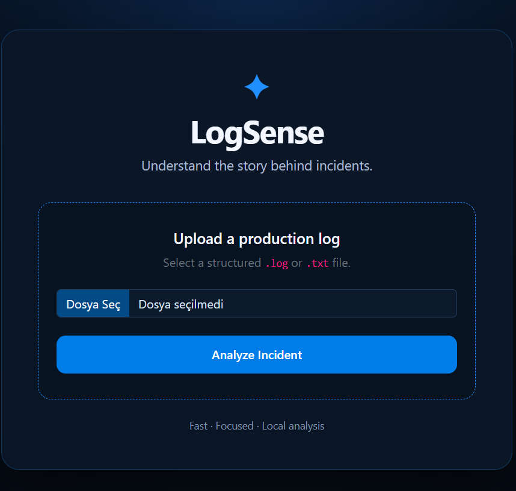
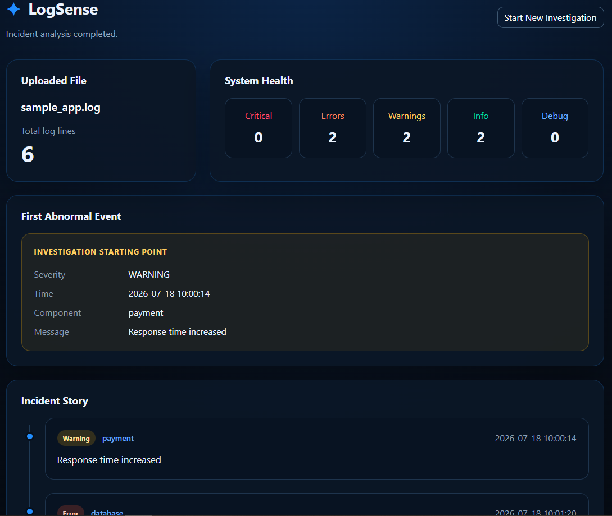

# ⭐ LogSense

### Understand Incidents Faster

LogSense is a web application designed to help Operations, SRE, and DevOps engineers investigate production incidents faster by transforming raw log files into a clear, structured incident analysis.

Instead of searching through thousands of log lines, LogSense identifies abnormal events, highlights where an incident began, tracks how it evolved, and shows which components were affected.

---

## 🚀 Why LogSense?

During production incidents, engineers often need to answer questions such as:

* Where did the incident start?
* Which component was affected first?
* What failures happened next?
* Which components generated the most abnormal activity?
* Did the system recover?

Traditional log analysis often requires engineers to manually search through large volumes of raw log data.

LogSense focuses on helping engineers quickly understand the sequence and scope of an incident so they can begin investigation faster.

---

## ✨ Current Features

* 📂 Upload `.log` and `.txt` files
* ✅ File validation
* ⚡ Streaming log-file processing
* 📊 Severity summary

  * Critical
  * Error
  * Warning
  * Info
  * Debug
* 🚨 First abnormal event detection
* 🧭 Incident Summary

  * Incident start time
  * Starting component
  * Initial severity
  * Current status
* ⏱️ Incident Timeline

  * Incident Started
  * Failure
  * Warning
  * Recovery
* 🔎 Component Impact analysis

  * Abnormal events grouped by component
* 🟢 Recovery detection
* 🎨 Modern dark user interface
* 🐳 Docker container support
* ⚙️ GitHub Actions CI

  * Docker image build
  * Container startup
  * Application health check

---

## 🛠️ Technology Stack

* Python
* FastAPI
* Uvicorn
* Jinja2
* HTML
* Bootstrap 5
* Docker
* Git
* GitHub Actions

---

## 🐳 Quick Start with Docker

### 1. Clone the repository

```bash
git clone https://github.com/brcsln/LogSense.git
cd LogSense
```

### 2. Build the Docker image

```bash
docker build -t logsense .
```

### 3. Run LogSense

```bash
docker run --name logsense-app -p 8000:8000 logsense
```

### 4. Open LogSense

Open:

```text
http://127.0.0.1:8000
```

Then upload a supported log file and start the investigation.

---

## 💻 Local Development

From the `backend` directory, create a virtual environment:

```bash
python -m venv venv
```

Install dependencies:

```bash
pip install -r requirements.txt
```

Run the application:

```bash
python -m uvicorn app:app --reload
```

Then open:

```text
http://127.0.0.1:8000
```

---

## ⚙️ Continuous Integration

LogSense uses GitHub Actions to automatically validate changes pushed to the `main` branch.

The CI workflow currently:

1. Checks out the LogSense source code.
2. Builds the Docker image.
3. Starts LogSense inside a container.
4. Sends a health-check request to the running application.
5. Reports success or failure.

This helps ensure that new changes can still build and run successfully in a clean environment.

---

## 📸 Screenshots

### Home Page



### Incident Analysis



---

## 🏗️ Architecture

```text
Log File
   ↓
FastAPI Upload
   ↓
Validation
   ↓
Log Parser
   ↓
Incident Analysis
   ├── Severity Summary
   ├── First Abnormal Event
   ├── Incident Summary
   ├── Incident Timeline
   └── Component Impact
   ↓
Investigation Report
```

---

## 🧭 Roadmap

### Next

* Automated parser tests with pytest
* Expanded incident impact analysis
* Support for additional log formats

### Later

* AI-assisted incident explanations
* Root cause suggestions
* Smart investigation summaries
* Cloud deployment
* Continuous deployment
* Docker and Kubernetes log support
* Grafana integration

---

## 💡 Vision

LogSense is not intended to replace engineers.

Its goal is to reduce investigation time by helping engineers quickly understand what happened, where the incident started, which components were affected, and how the incident evolved.

The long-term goal is simple:

> **Help engineers spend less time reading logs and more time solving incidents.**

---

## 👩‍💻 Author

**Burcu Aslan**

Team Lead | Scrum Master | Automation & IT Systems Engineer

Building products that simplify production operations.
